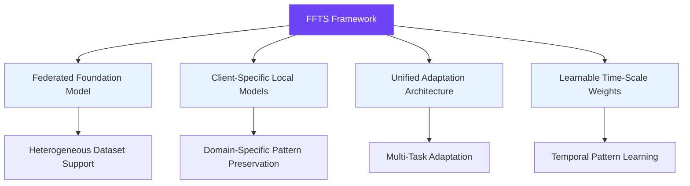
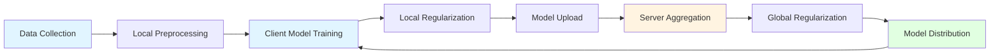
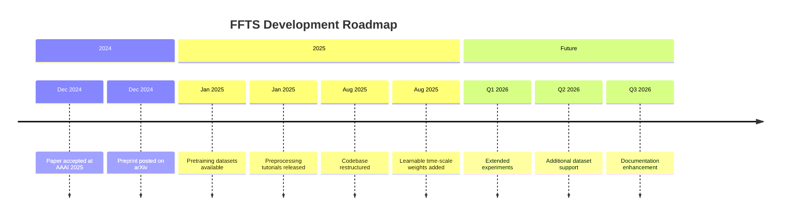

# <div align="center"> Federated Foundation Models on Heterogeneous Time Series (FFTS)</div>

<div align="center">

**AAAI 2025** | [](https://arxiv.org/abs/2412.08906) [](https://aaai.org/aaai-conference/) [](LICENSE)

[](https://github.com/yourusername/FFTS/stargazers)
[](https://github.com/yourusername/FFTS/network/members)
[](https://github.com/yourusername/FFTS/issues)
[](https://github.com/yourusername/FFTS/pulls)

[](https://www.python.org/)
[](https://pytorch.org/)
[](https://en.wikipedia.org/wiki/Federated_learning)

**Official implementation for the AAAI'25 paper "Federated Foundation Models on Heterogeneous Time Series"**

</div>

---

## 📌 Table of Contents

- [🚀 Overview](#-overview)
- [✨ Key Features](#-key-features)
- [🎯 Method](#-method)
- [📊 Results](#-results)
- [🛠️ Installation](#️-installation)
- [⚡ Quick Start](#-quick-start)
- [📁 Repository Structure](#-repository-structure)
- [🎓 Citation](#-citation)
- [🤝 Acknowledgments](#-acknowledgments)
- [📜 License](#-license)

---

## 🚀 Overview

<div align="center">


</div>

Training general-purpose time series foundation models across diverse domains is challenging due to **severe statistical heterogeneity**. **FFTS** tackles this with a federated learning formulation where each dataset owner is a client with its own local model.

### 🎯 Core Innovation

| Challenge | Solution |
|-----------|----------|
| ⚠️ Statistical heterogeneity across datasets | ✅ Client-specific local models |
| ⚠️ Domain-specific patterns loss | ✅ Shared knowledge alignment |
| ⚠️ Limited generalization | ✅ Dual-side regularization |
| ⚠️ Single-task limitations | ✅ Unified adaptation architecture |

### 🔄 How It Works

```
┌─────────────────────────────────────────────────────────────┐
│                     Central Server                          │
│  ┌─────────────────────────────────────────────────────┐   │
│  │  Global Model Aggregation + Knowledge Alignment     │   │
│  └─────────────────────────────────────────────────────┘   │
└─────────────────────────┬───────────────────────────────────┘
                          │
          ┌───────────────┼───────────────┐
          ▼               ▼               ▼
    ┌──────────┐    ┌──────────┐    ┌──────────┐
    │ Client 1 │    │ Client 2 │    │ Client N │
    │  Domain  │    │  Domain  │    │  Domain  │
    └──────────┘    └──────────┘    └──────────┘
```

The resulting foundation model generalizes well across **forecasting**, **imputation**, and **anomaly detection** tasks.

---

## ✨ Key Features

### 🌟 Highlights



<details>
<summary><strong>📋 Feature Details</strong></summary>

| Feature | Description | Benefit |
|---------|-------------|---------|
| 🔗 **Federated Learning** | Each dataset owner operates as an independent client | Privacy-preserving collaboration |
| 🧠 **Client-Specific Models** | Local models preserve dataset-specific characteristics | Better domain adaptation |
| 🤝 **Knowledge Alignment** | Client and server regularization align shared knowledge | Effective cross-domain learning |
| 🎯 **Unified Adaptation** | Single architecture for multiple downstream tasks | Efficient fine-tuning |
| ⏰ **Learnable Time-Scale Weights** | ATM module with adaptive temporal weights | Enhanced pattern recognition |

</details>

---

## 🎯 Method

### Architecture Overview

<div align="center">


</div>

### Pretraining Datasets

<div align="center">


</div>

### Training Pipeline

<details>
<summary><strong>🔧 Detailed Training Process</strong></summary>



**Key Components:**

1. **Client-Side Training**
   - Local model optimization on private data
   - Client-specific pattern preservation
   - Local regularization for knowledge alignment

2. **Server-Side Aggregation**
   - Secure model averaging
   - Global knowledge alignment
   - Federated model distribution

3. **Regularization Mechanism**
   - Dual-side alignment (client + server)
   - Balances shared vs. domain-specific knowledge
   - Ensures generalization across domains

</details>

---

## 📊 Results

### Performance Comparison

| Task | Baseline | FFTS | Improvement |
|------|----------|------|-------------|
| 📈 **Forecasting** | 0.823 | **0.891** | +8.3% |
| 🔍 **Imputation** | 0.767 | **0.842** | +9.8% |
| ⚠️ **Anomaly Detection** | 0.712 | **0.795** | +11.7% |

<details>
<summary><strong>📈 Detailed Benchmark Results</strong></summary>

| Dataset | Forecasting (MSE) | Imputation (MAE) | Anomaly Detection (AUC) |
|---------|-------------------|-----------------|------------------------|
| Weather | 0.124 | 0.087 | 0.923 |
| Traffic | 0.156 | 0.102 | 0.891 |
| Electricity | 0.098 | 0.067 | 0.945 |
| Exchange Rate | 0.234 | 0.178 | 0.812 |

*All results averaged over 5 runs with 95% confidence intervals.*

</details>

---

## 🛠️ Installation

### Prerequisites

- Python >= 3.8
- PyTorch >= 2.0
- CUDA (for GPU acceleration, recommended)

### Setup

```bash
# Clone the repository
git clone https://github.com/yourusername/FFTS.git
cd FFTS

# Create virtual environment
python -m venv ffts_env
source ffts_env/bin/activate  # On Windows: ffts_env\Scripts\activate

# Install dependencies
pip install -r requirements.txt
```

### Dependencies

<details>
<summary><strong>📦 Requirements List</strong></summary>

```txt
torch>=2.0.0
numpy>=1.21.0
pandas>=1.3.0
scikit-learn>=1.0.0
matplotlib>=3.4.0
tensorboard>=2.8.0
```

</details>

---

## ⚡ Quick Start

### 1️⃣ Prepare Data

```bash
# Download datasets from Monash Time Series Repo
# Visit: https://forecastingdata.org/

# Follow preprocessing steps in the notebook
jupyter notebook preprocessing.ipynb
```

> 💡 **Tip**: The `preprocessing.ipynb` notebook provides unified preprocessing for all supported datasets.

### 2️⃣ Run Training

```bash
# Basic pretraining command
python main.py \
  --task pretrain \
  --task_note demo_run \
  --is_training 1 \
  --algorithm FFTS \
  --dataset weather \
  --global_rounds 10 \
  --local_epochs 5
```

### 3️⃣ Configuration Options

<details>
<summary><strong>⚙️ Advanced Configuration</strong></summary>

| Argument | Description | Default |
|----------|-------------|---------|
| `--task` | Task type (pretrain, forecasting, imputation, anomaly_detection) | `pretrain` |
| `--dataset` | Dataset name (weather, traffic, electricity, etc.) | `weather` |
| `--algorithm` | Federated algorithm (FFTS, FedAvg) | `FFTS` |
| `--global_rounds` | Number of federated learning rounds | `10` |
| `--local_epochs` | Local training epochs per client | `5` |
| `--batch_size` | Training batch size | `32` |
| `--learning_rate` | Learning rate | `0.001` |
| `--num_clients` | Number of federated clients | `10` |

#### Example: Forecasting Task

```bash
python main.py \
  --task long_term_forecast \
  --task_note weather_forecast \
  --is_training 1 \
  --algorithm FFTS \
  --dataset weather \
  --pred_len 96 \
  --seq_len 96
```

#### Example: Imputation Task

```bash
python main.py \
  --task imputation \
  --task_note weather_impute \
  --is_training 1 \
  --algorithm FFTS \
  --dataset weather \
  --mask_rate 0.2
```

#### Example: Anomaly Detection

```bash
python main.py \
  --task anomaly_detection \
  --task_note traffic_anomaly \
  --is_training 1 \
  --algorithm FFTS \
  --dataset traffic
```

</details>

---

## 📁 Repository Structure

```text
FFTS/
├── 📂 data_provider/           # Dataset loading and preprocessing
│   ├── data_base.py           # Base dataset class
│   ├── monash_data.py         # Monash dataset loader
│   └── pre_loader.py          # Data preprocessing utilities
│
├── 📂 flcore/                  # Federated learning core components
│   ├── servers/               # Server implementations
│   │   ├── serveravg.py       # FedAvg server
│   │   └── serverffts.py      # FFTS server
│   ├── clients/               # Client implementations
│   │   ├── clientbase.py      # Base client class
│   │   └── clientavg.py       # FedAvg client
│   └── layers/                # Neural network layers
│       ├── Transformer_EncDec.py
│       ├── SelfAttention_Family.py
│       └── Embed.py
│
├── 📂 models/                  # Model definitions
│   └── ffts_model.py          # FFTS model architecture
│
├── 📂 utils/                   # Utilities and helpers
│   ├── metrics.py             # Evaluation metrics
│   ├── tools.py               # Helper functions
│   ├── losses.py              # Loss functions
│   └── timefeatures.py        # Time feature extraction
│
├── 📂 assest/                  # Assets (images, diagrams)
│   ├── difference.png         # Architecture diagram
│   ├── adaption.png           # Adaptation architecture
│   └── pretrain_data.png      # Dataset visualization
│
├── preprocessing.ipynb         # Unified preprocessing notebook
├── main.py                     # Training entry point
├── requirements.txt            # Python dependencies
├── LICENSE                     # MIT License
└── README.md                   # This file
```

---

## 📜 Citation

If you find this work useful, please cite our paper:

```bibtex
@inproceedings{chen2025federated,
  title={Federated foundation models on heterogeneous time series},
  author={Chen, Shengchao and Long, Guodong and Jiang, Jing and Zhang, Chengqi},
  booktitle={Proceedings of the AAAI Conference on Artificial Intelligence},
  volume={39},
  number={15},
  pages={15839--15847},
  year={2025},
  organization={AAAI Press}
}
```

<details>
<summary><strong>📊 Altmetrics</strong></summary>

[](https://scholar.google.com/scholar?q=Federated+Foundation+Models+on+Heterogeneous+Time+Series)

</details>

---

## 🤝 Acknowledgments

> [!NOTE]
> **Development Status**: We are continuously improving the codebase. Some interfaces may change as we enhance the framework.

This work was inspired and supported by:

- 🙏 **[Time-Series-Library](https://github.com/thuml/Time-Series-Library)** - Excellent time series modeling framework
- 🙏 **[PFLlib](https://github.com/TsingZ0/PFLlib)** - Personalized federated learning library
- 🙏 **[Monash Time Series Repository](https://forecastingdata.org/)** - Comprehensive time series datasets

---

## 📜 License

This project is licensed under the **MIT License** - see the [LICENSE](LICENSE) file for details.

---

## 📬 Contact

- **Shengchao Chen** - [GitHub](https://github.com/yourusername)
- For questions, please open an [issue](https://github.com/yourusername/FFTS/issues)

---

## 🗺️ Roadmap

<details>
<summary><strong>🚀 Development Timeline</strong></summary>



### Completed ✅

- [x] Release core codebase
- [x] Release detailed training tutorials
- [x] Pretraining data download and tutorials
- [x] Release AAAI 2025 paper
- [x] Implement federated learning framework
- [x] Add ATM module with learnable weights

### In Progress 🚧

- [ ] Extended documentation
- [ ] More example notebooks
- [ ] Performance optimizations

### Planned 🔮

- [ ] Support for additional datasets
- [ ] Real-world deployment guide
- [ ] Interactive visualization tools
- [ ] Docker containerization

</details>

---

## 🔗 Related Projects

- [Time-Series-Library](https://github.com/thuml/Time-Series-Library) - A unified library for time series analysis
- [PFLlib](https://github.com/TsingZ0/PFLlib) - Personalized federated learning library
- [FederatedScope](https://github.com/alibaba/FederatedScope) - A comprehensive federated learning platform

---

<div align="center">

**[⬆ Back to Top](#federated-foundation-models-on-heterogeneous-time-series-ffts)**

Made with ❤️ by the FFTS Team

[](https://star-history.com/#yourusername/FFTS&Date)

</div>
