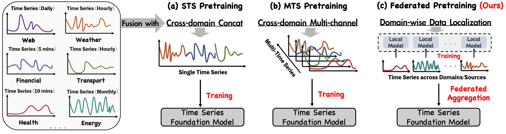
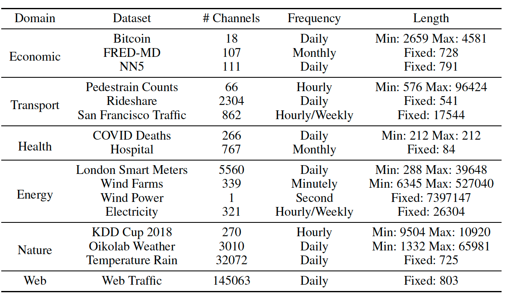
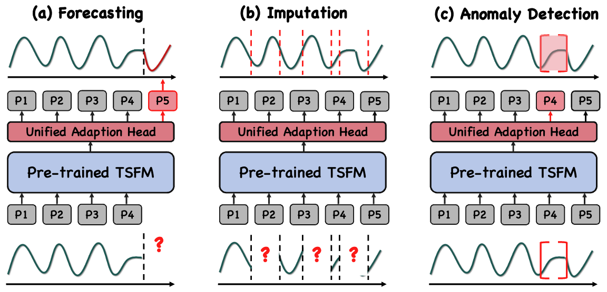

# Federated Foundation Models on Heterogeneous Time Series - AAAI'2025

### Official implementation for our AAAI'25 paper "Federated Foundation Models on Heterogeneous Time Series".

---

:triangular_flag_on_post:**News** (2025.01.09) You can download the pretraining dataset from the [Monash Time Series Repo](https://forecastingdata.org/) based on the [Pretrainig Dataset Overview](#Datasets) (at your own risk). We also provide unified preprocessing tools in `preprocessing.ipynb`. 

:triangular_flag_on_post:**News** (2024.12.18) Our paper has been posted in [Federated Foundation Models on Heterogeneous Time Series](https://arxiv.org/abs/2412.08906), the technical appendix will be updated ASAP.

:triangular_flag_on_post:**News** (2024.12.10) Our paper has been accepted by **AAAI 2025** and we will be releasing the preprint and code for our paper ASAP.


---
- [ ] Release code
- [ ] Release detailed training tutorials
- [x] Pre-training data download and corresponding tutorials
- [x] Release papers
---
**Abstract**

Training a general-purpose time series foundation models with robust generalization capabilities across diverse applications from scratch is still an open challenge. Efforts are primarily focused on fusing cross-domain time series datasets to extract shared subsequences as tokens for training models on Transformer architecture. However, due to significant statistical heterogeneity across domains, this cross-domain fusing approach doesn't work effectively as the same as fusing texts and images. ***To tackle this challenge, this paper proposes a novel federated learning approach to address the heterogeneity in time series foundation models training, namely FFTS.*** Specifically, each data-holding organization is treated as an independent client in a collaborative learning framework with federated settings, and then many client-specific local models will be trained to preserve the unique characteristics per dataset. Moreover, a new regularization mechanism will be applied to both client-side and server-side, thus to align the shared knowledge across heterogeneous datasets from different domains. Extensive experiments on benchmark datasets demonstrate the effectiveness of the proposed federated learning approach. ***The newly learned time series foundation models achieve superior generalization capabilities on cross-domain time series analysis tasks, including forecasting, imputation, and anomaly detection.***

## What's News about our framework for time series foundation models training


## We used (open-sourced) cross-domain time series datasets for pretraining:


## We used unified adaption architecture for downstream adaption:



## Please cite our publication if you found our research to be helpful and insightful!
```bibtex
@misc{chen2024federatedfoundationmodelsheterogeneous,
      title={Federated Foundation Models on Heterogeneous Time Series}, 
      author={Shengchao Chen and Guodong Long and Jing Jiang and Chengqi Zhang},
      year={2024},
      eprint={2412.08906},
      archivePrefix={arXiv},
      primaryClass={cs.LG},
      url={https://arxiv.org/abs/2412.08906}, 
}
```

## Acknolwedgement
> [!note]
> We are reshaping our code. There may be some changes to the code.